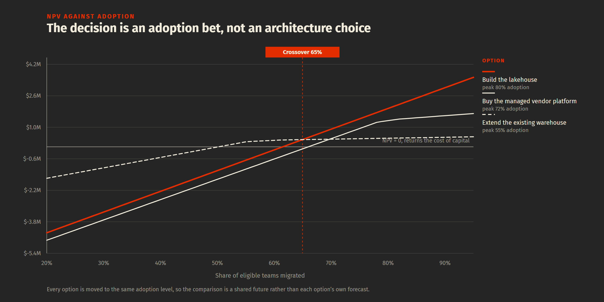

# Platform investment case: build, extend, or buy

> A decision model for the question every data leader eventually has to answer
> in front of a CFO. Build the lakehouse, extend the warehouse, or buy the
> vendor platform. Runs a DCF, a decision tree and a Monte Carlo over the same
> scenarios, then generates the recommendation memo.

[](https://github.com/wanwrick/platform-investment-case/actions/workflows/tests.yml)



---

## The finding

On the illustrative numbers in `scenarios/`, the three views disagree, and the
disagreement is the answer.

| View | Winner | Why |
|---|---|---|
| Point-estimate NPV | Build the lakehouse, $1.96M | It assumes the plan lands |
| Expected NPV across weighted futures | Extend the warehouse, $79K | Build loses in 65% of futures |
| Monte Carlo, 5,000 trials | Extend the warehouse, 79% of trials | Build wins only when adoption is high |

**Build the lakehouse is worth more than extending the warehouse above 65%
adoption, and worth less below it.** That single number is the decision. Not
the architecture, not the vendor, not the NPV table.

The generated memo is in [`output/recommendation.md`](output/recommendation.md).

---

## Why this repo exists

Most platform business cases are a spreadsheet with one NPV in it. That number
is a forecast of adoption wearing a forecast of value, and it is almost always
built on the assumption that the migration plan works.

This model separates the two. Costs are committed early and are reasonably
knowable. Benefits are not: nearly all of them depend on how many teams actually
move, and nobody can promise that. So adoption is modelled explicitly, and every
sensitivity in the repo moves it.

The output is not a number. It is a condition of approval.

---

## Run it

```bash
pip install -r requirements.txt
python run.py --summary        # the headline table
python run.py                  # writes output/recommendation.md
pytest -q                      # 54 tests
```

Edit anything in `scenarios/` and rerun. The memo is generated from the model,
so the prose cannot drift from the numbers it cites.

---

## How it works

```
scenarios/*.yaml                 three options plus shared assumptions
        |
        v
  model.py        adoption S-curve -> benefit ramp -> FCF schedule
  finance.py      CAPM -> WACC -> NPV, IRR, PI, payback, EAV
        |
        +-- uncertainty.py
        |     breakeven adoption      what has to be true
        |     crossover adoption      when the ambitious option wins
        |     decision tree           weighted futures, chance of loss
        |     Monte Carlo             joint sampling, win rate
        v
  memo.py         SCR memo, recommendation first
        |
        v
  output/recommendation.md
```

### Four modelling decisions that change the answer

**Benefits are measured against a do-nothing baseline.** An option that retires
the existing warehouse books that spend as an avoided cost. It is the largest
single benefit line and the one most often left out of a platform business case.

**Capability caps adoption rather than discounting it.** A team whose workload
the platform cannot serve does not migrate at reduced value; it does not
migrate. Multiplying adoption by a capability factor would penalise an option
twice for one constraint.

**An overrun hits the build, not the run.** Scaling seven years of steady-state
platform cost by an overrun factor models a permanent tax on operating the
thing, which is a different and much larger claim. Getting this wrong makes
every capital-heavy option look unviable, and it is an easy mistake to make.

**The simulation samples jointly on a shared seed.** Adoption, benefit
realization and cost overrun are drawn together, and every option faces the same
world in each trial. Sampling them separately understates the tail: the world
where adoption stalls is usually also the world where the migration ran over.

---

## Frameworks applied

| Framework | Course | Where it shows up |
|---|---|---|
| CAPM and WACC | Managerial Finance (Prof. Mao Ye) | `finance.py`, the discount rate |
| NPV, IRR, PI, payback | Managerial Finance | `finance.py` |
| Equivalent annual value | Corporate Financial Policy (Prof. Carvell) | Comparing options with different useful lives |
| Tax shield on debt and depreciation | Corporate Financial Policy | WACC, and the FCF add-back in `model.py` |
| Decision trees and expected value | Business Decision Models (Prof. Paul Roman) | `uncertainty.decision_tree` |
| Monte Carlo and sensitivity analysis | Business Decision Models | `uncertainty.monte_carlo` |
| Switching cost and lock-in | Business Strategy (Prof. Justin Johnson) | Priced explicitly per option |
| SCR and the Pyramid Principle | Critical Thinking (Prof. Risa Mish) | `memo.py` structure |

---

## Tests

```bash
pytest -q        # 54 tests
```

Every expected value in `test_finance.py` was worked out by hand or from a
closed-form identity, never captured from a previous run. A business case is
only as good as its arithmetic, and arithmetic is the part nobody re-derives in
the room.

The model tests pin down the decisions someone could quietly reverse: that
depreciation is added back, that a loss year produces a tax credit rather than a
zero, that capability caps adoption, and that an overrun does not become a
permanent tax on operations.

Two tests earned their place by failing. The equivalent-annual-value test caught
a case where the longer project did not actually have the higher NPV, so the
test was not demonstrating what it claimed. The adoption test caught that
raising a ceiling above the capability cap still lifts NPV, because a steeper
curve reaches the cap sooner. That is correct behaviour and the original
assertion was wrong.

---

## What is not modelled

Stated plainly, because a model that hides its edges is worse than no model.

- **Terminal value.** The horizon ends at year 7 with no continuing value. That
  understates every option, and understates the long-lived ones most.
- **Real options.** The staged recommendation in the memo is argued in prose,
  not priced. A proper treatment would value the option to defer.
- **Risk-adjusted discount rates per option.** All three are discounted at the
  same WACC. A purist would argue the build carries more project risk.
- **Correlation between the sampled inputs.** They are drawn jointly but
  independently. In practice adoption and overrun are negatively correlated,
  which would widen the tail further.

---

## A note on the numbers

Every figure in `scenarios/` is illustrative and belongs to no employer. They
describe a hypothetical mid-size financial services firm with roughly 40
data-consuming teams. The point of the repo is the method, not the dataset.

---

**Paroz Mehta** · [LinkedIn](https://linkedin.com/in/parozmehta)
